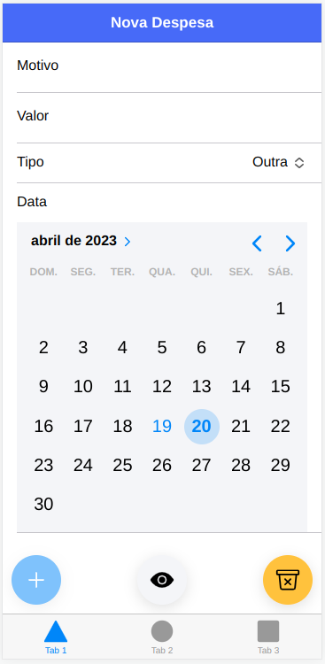

# Overview

O objetivo desse projeto é criar um app para **Controle de despesas** com o layout semelhante ao da imagem abaixo:



# Desenvolvendo o app:

### Componentes do Ionic necessários:

- Ion-input
- Ion-list
- Ion-item
- Ion-label
- Ion-button
- Ion-fab
- Ion-fab-button
- Ion-icon
- Ion-datetime

**Documentação oficinal:** https://ionicframework.com/docs/components

### Passo a passo:
- Arquivo `tab1.page.html`
    1. Desenvolver o layout por meio da utilização dos componentes Ionic;
    2. Adicionar a tag *forms*;
    3. Criar e adicionar nome do elemento e função dos botões (name="add" (click)="adicionar()");

- Arquivo `tab1.page.ts`
    1. Criar e adicionar as funções (adicionar(){}), após o *construtor*;
    2. Importar os componentes para trabalhar com o formulário: 
```typescript
    import  {ReactiveFormsModule, FormGroup, FormBuilder, Validators } from '@angular/forms';
```
    3. Criar um objeto FormGroup no seu componente:

```typescript
    fg: FormGroup;
```
    4. Inicializando o objeto FormGroup usando o **FormBuilder**:

```typescript
    constructor(private fb: FormBuilder) {
    this.fg = this.fb.group({ });
}
```
- Arquivo `tab1.page.html`
    1. Adicionar ao formulário o atributo `[FormGroup]` ligando esse atributo ao nome da variável passada no arquivo .ts: `[formGroup]="fg"`
    2. Criar os campos de entrada. Cada campo é associado a um ***FormControlName***, que é o nome da propriedade do **FormGroup** que representa o valor do campo.

- Arquivo `tab1.page.ts`
    1. Definindo os campos do formulário e as validações necessárias para cada campo:

```typescript
constructor( 
    private fb: FormBuilder) {
    this.fg = fb.group({
      motivo: ['', Validators.required], //4. adicionar os validators
      valor: [0.0, Validators.required],
      tipo: ['', Validators.required],
      data: [new Date().toISOString, Validators.required]
    });
}
```
    2. Use o objeto **FormGroup** para acessar e manipular os dados do formulário.
```typescript
{
 console.log(this.fg.value);
}
```


### Conceitos importantes:

Nesse projeto usamos forumlários. Esse projeto é do tipo **Angular** logo a utilização dos formulários pode ser feita por meio da importação dos modulos relevantes para essa construção: `ReactiveFormsModule, FormGroup, FormBuilder, Validators`, todos esses componentes percentem ao  `@angular/forms`.

- O **ReactiveFormsModule** é um módulo Angular que oferece suporte à criação de formulários usando a abordagem reativa, que é uma maneira declarativa de criar formulários usando classes T*ypeScript*.

Ao importar o ReactiveFormsModule no módulo do seu componente, você pode usar suas classes e diretivas para criar e gerenciar formulários reativos no seu aplicativo. Ele fornece a **classe FormGroup** para agrupar controles de formulário, a **classe FormControl** para representar um único controle de formulário e a **classe FormBuilder** para criar instâncias *FormGroup* com mais facilidade.

- O **FormGroup** é uma classe que representa um grupo de controles de formulário no Angular. Ele é usado para agrupar os controles do formulário.

- O **FormBuilder** é uma classe utilitária que fornece métodos para simplificar a criação de instâncias de FormGroup e FormControl. Sua utilização facilita a criação de instâncias de *FormGroup* com mais facilidade.

- O **Validators**, por sua vez, é um conjunto de funções de validação fornecidas pelo **ReactiveFormsModule** para validar os valores de entrada do formulário. Essas funções podem ser usadas para validar se um campo é obrigatório, se o valor inserido é um número, se o valor inserido é um endereço de email válido, entre outras validações.Algumas das funções de validação fornecidas pelo Validators são:

    - required: para verificar se um campo é obrigatório
    - email: para verificar se um campo contém um endereço de email válido
    - minLength: para verificar se um campo tem pelo menos um número mínimo de caracteres
    - maxLength: para verificar se um campo tem um número máximo de caracteres
    - pattern: para verificar se um campo atende a um padrão de expressão regular
